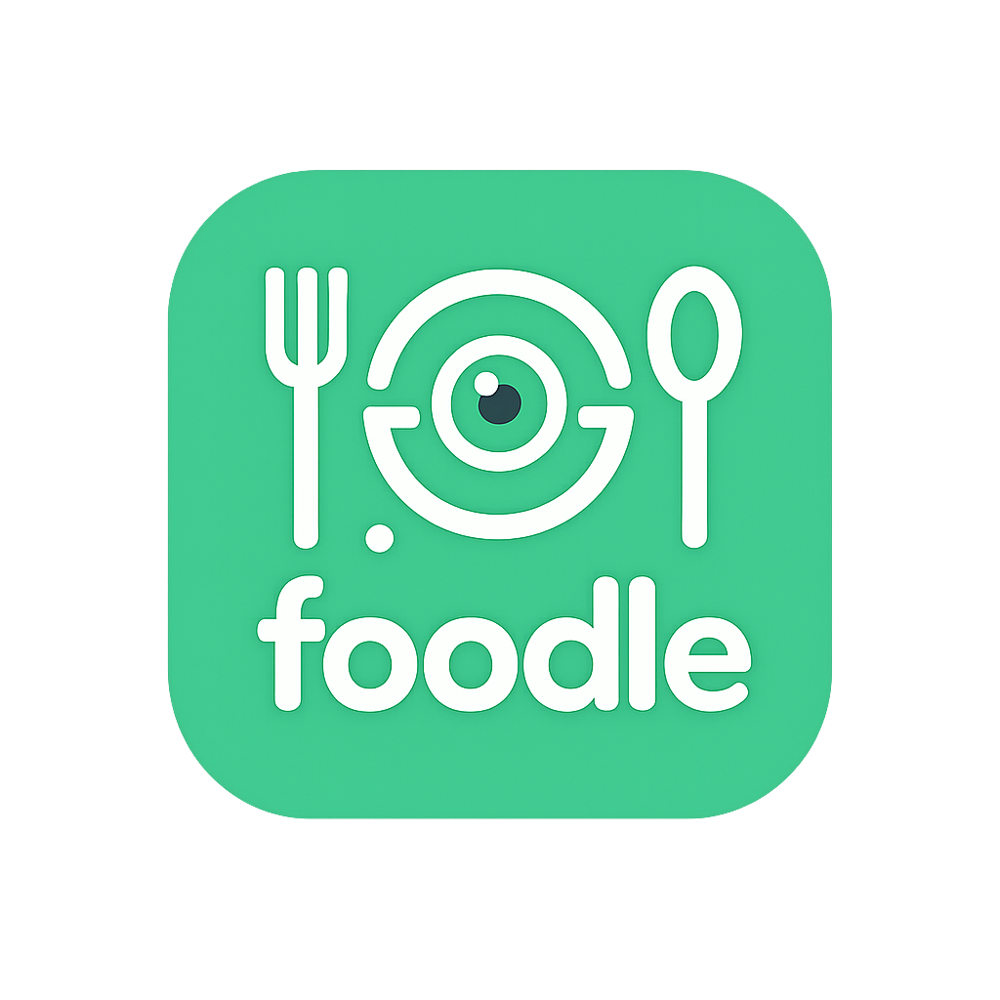

 

<h1 align="center">Foodle</h1>

Instantly search the truth inside your food.
 
<strong><a href="https://foodle-meal-scanner-git-main-anveshs-projects-9789ac3d.vercel.app/">View the Live Demo</a></strong>

Our Vision
In today's world, food labels are intentionally confusing. Choosing healthy options is a daily struggle, directly contributing to lifestyle diseases across India. Our goal is to eliminate this confusion and make healthy eating a simple, transparent, and effortless choice for everyone.

What is Foodle?
Just as Google lets you search for any information, Foodle lets you instantly "search" for the truth inside your food.

It's a smart nutrition decoder that transforms your phone's camera into a powerful tool for better health. By scanning any product barcode, Foodle provides an immediate, personalized verdict—like "Good to Go!" or "Think Twice"—based on your unique health profile. We cut through the jargon so you don't have to.

Key Features
📱 Instant Scanning: Scan a product barcode using your device's camera or by uploading an image.

🧠 Personalized Verdicts: Receive clear, color-coded recommendations tailored to your personal health goals and conditions (e.g., Diabetes, Weight Loss).

📊 Simple Nutrition Summary: See a clean, jargon-free breakdown of key nutrients like calories, sugar, and fat.

👤 On-the-Fly Profiles: Simulate different user profiles to see how recommendations change, showcasing the app's dynamic intelligence.

Technology & Architecture
We chose a modern, efficient tech stack to build a fast and responsive web application.

Frontend Framework: React (via Vite) was chosen for its component-based architecture and blazing-fast development server, allowing for rapid prototyping.

API Communication: We use Axios for robust, promise-based requests to the Open Food Facts API, our primary source of nutritional data.

Core Modules:

html5-qrcode: A powerful library integrated for live, in-browser barcode scanning and file-based decoding.

Verdict Engine: A custom-built logic module in JavaScript that cross-references product nutrients against a user's health profile to generate personalized advice.

Deployment: The entire application is deployed on Vercel, providing seamless continuous integration and delivery directly from our Git repository.

Our Team
Meet Alpha Bytes, the dedicated team of six students from CSE (LNCTE), who brought this project to life for the Smart India Hackathon 2025.
